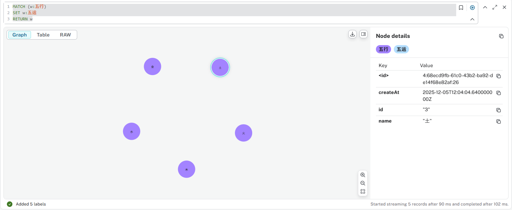
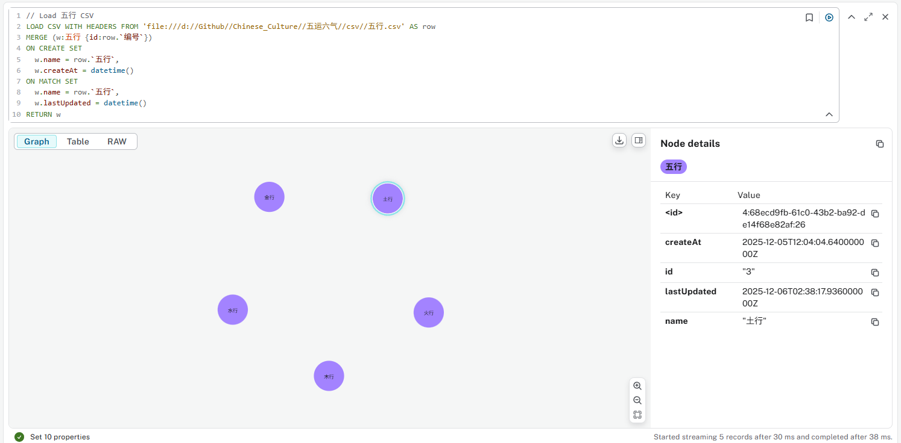
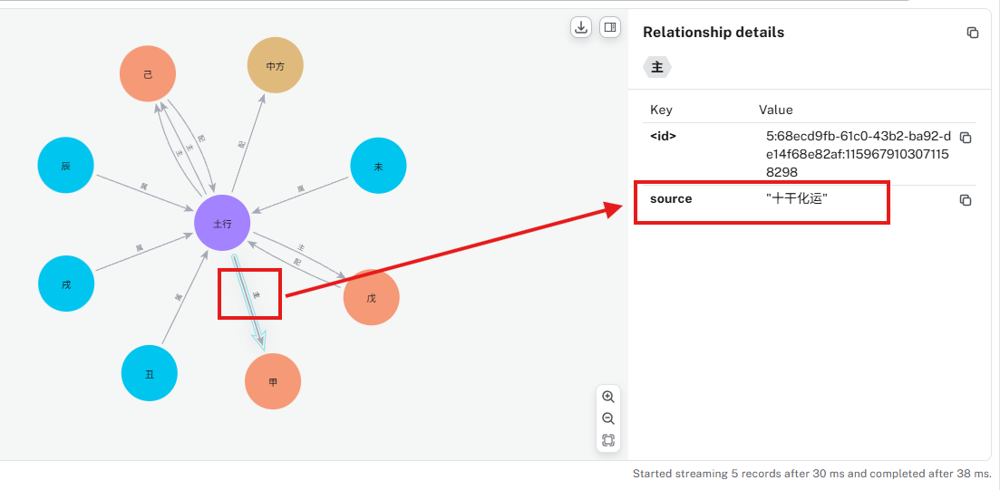
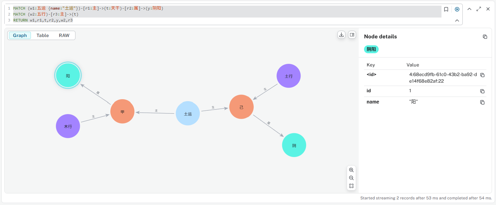
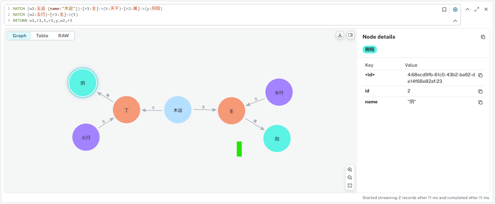
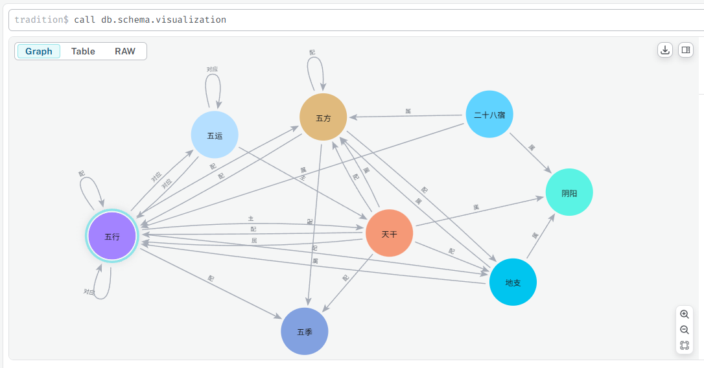
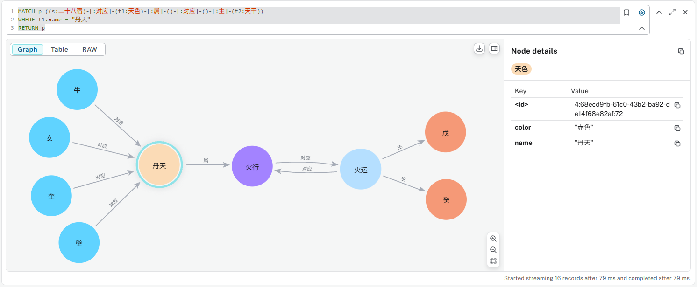

# Create Graph for Chinese Tradition Culture

- [Create Graph for Chinese Tradition Culture](#create-graph-for-chinese-tradition-culture)
  - [Create `阴阳` node](#create-阴阳-node)
  - [Add `天干` node](#add-天干-node)
  - [Add `地支` node](#add-地支-node)
  - [Refactor 天干地支 to Match 阴阳](#refactor-天干地支-to-match-阴阳)
  - [创建`甲子表`，建立天干与地支的关系`配`](#创建甲子表建立天干与地支的关系配)
  - [Query 天干地支](#query-天干地支)
  - [添加 五行、五方、五季](#添加-五行五方五季)
  - [创建 十干五行配合 关系](#创建-十干五行配合-关系)
  - [创建 十二支月建五行所属 关系](#创建-十二支月建五行所属-关系)
  - [十干化运：对于天干到五行之配属关系，添加五行到天干之“主”关系](#十干化运对于天干到五行之配属关系添加五行到天干之主关系)
  - [目前为止的schema (ver01)](#目前为止的schema-ver01)
- [对“五运”建模](#对五运建模)
  - [对“五行”node添加“五运”Label](#对五行node添加五运label)
  - [十干化运](#十干化运)
  - [Refactor 分开 五行 和 五运](#refactor-分开-五行-和-五运)
  - [创建“五运”Node，不是Label](#创建五运node不是label)
  - [创建“十干化运”关系](#创建十干化运关系)
  - [十干化运的查询解释](#十干化运的查询解释)
  - [Schema So far (ver02)](#schema-so-far-ver02)
  - [连接“五行”和“五运”，关系“对应”](#连接五行和五运关系对应)
  - [创建“二十八宿”](#创建二十八宿)
  - [Schema So Far (ver03)](#schema-so-far-ver03)
  - [建立“天色”node并“天色”与“五行”的关系](#建立天色node并天色与五行的关系)
  - [更新“二十八宿”，添加对应“天色”的关系](#更新二十八宿添加对应天色的关系)
- [解释“五气经天化五运” --《素问》五运行大论](#解释五气经天化五运---素问五运行大论)
  - [“丹天之气，经于牛女戊分”](#丹天之气经于牛女戊分)
  - [“黅天之气，经于心尾己分”](#黅天之气经于心尾己分)
  - [“苍天之气，经于危室柳鬼”](#苍天之气经于危室柳鬼)
  - [“素天之气，经于亢氐昴毕”](#素天之气经于亢氐昴毕)
  - [“玄天之气，经于张翼娄胃”](#玄天之气经于张翼娄胃)
- [Tool](#tool)

## Create `阴阳` node

```cypher
MERGE (y1:阴阳 {id:1, name:"阳"})
MERGE (y2:阴阳 {id:2, name:"阴"})
```

## Add `天干` node

```cypher
// Load 天干 CSV
LOAD CSV WITH HEADERS FROM 'file:///d://Github//Chinese_Culture//五运六气//csv//天干.csv' AS row
MERGE (t:天干 {id:row.`编号`})
ON CREATE SET
  t.name = row.`天干`,
  t.pinyin = row.`拼音`,
  t.yinyang = row.`阴阳`,
  t.createAt = datetime()
ON MATCH SET
  t.name = row.`天干`,
  t.pinyin = row.`拼音`,
  t.yinyang = row.`阴阳`,
  t.lastUpdated = datetime()
RETURN t
```


## Add `地支` node

```cypher
// Load 地支 CSV
LOAD CSV WITH HEADERS FROM 'file:///d://Github//Chinese_Culture//五运六气//csv//地支.csv' AS row
MERGE (d:地支 {id:row.`编号`})
ON CREATE SET
  d.name = row.`地支`,
  d.pinyin = row.`拼音`,
  d.yinyang = row.`阴阳`,
  d.createAt = datetime()
ON MATCH SET
  d.name = row.`地支`,
  d.pinyin = row.`拼音`,
  d.yinyang = row.`阴阳`,
  d.lastUpdated = datetime()
RETURN d
```


## Refactor 天干地支 to Match 阴阳

```cypher
// 阳干属阳
MATCH (t:天干),(y:阴阳)
WHERE t.yinyang CONTAINS "阳" AND y.name = "阳"
MERGE (t)-[s:属]->(y)
RETURN t,s,y
```

```cypher
// 阴干属阴
MATCH (t:天干),(y:阴阳)
WHERE t.yinyang = "阴干" AND y.name = "阴"
MERGE (t)-[s:属]->(y)
RETURN t,s,y
```

```cypher
// 阳支属阳
MATCH (d:地支),(y:阴阳)
WHERE d.yinyang CONTAINS "阳" AND y.name = "阳"
MERGE (d)-[s:属]->(y)
RETURN d,s,y
```

```cypher
// 阴支属阴
MATCH (d:地支),(y:阴阳)
WHERE d.yinyang CONTAINS "阴" AND y.name = "阴"
MERGE (d)-[s:属]->(y)
RETURN d,s,y
```

## 创建`甲子表`，建立天干与地支的关系`配`

```cypher
// Load 甲子表 CSV
LOAD CSV WITH HEADERS FROM 'file:///d://Github//Chinese_Culture//五运六气//csv//甲子表.csv' AS row
MATCH (t:天干), (d:地支)
WHERE t.name = row.`天干` AND d.name = row.`地支`
MERGE (t)-[p:配 {id:row.`编号`}]->(d)
ON CREATE SET
  d.createAt = datetime()
ON MATCH SET
  d.lastUpdated = datetime()
RETURN t,p,d
```


## Query 天干地支

```cypher
MATCH (t:天干)-[p:配]->(d:地支)
RETURN t,p,d
```

## 添加 五行、五方、五季

```cypher
// Load 五行 CSV
LOAD CSV WITH HEADERS FROM 'file:///d://Github//Chinese_Culture//五运六气//csv//五行.csv' AS row
MERGE (w:五行 {id:row.`编号`})
ON CREATE SET
  w.name = row.`五行`,
  w.createAt = datetime()
ON MATCH SET
  w.name = row.`五行`,
  w.lastUpdated = datetime()
RETURN w
```

```cypher
// Load 五方 CSV
LOAD CSV WITH HEADERS FROM 'file:///d://Github//Chinese_Culture//五运六气//csv//五方.csv' AS row
MERGE (w:五方 {id:row.`编号`})
ON CREATE SET
  w.name = row.`五方`,
  w.createAt = datetime()
ON MATCH SET
  w.name = row.`五方`,
  w.lastUpdated = datetime()
RETURN w
```

```cypher
// Load 五季 CSV
LOAD CSV WITH HEADERS FROM 'file:///d://Github//Chinese_Culture//五运六气//csv//五季.csv' AS row
MERGE (w:五季 {id:row.`编号`})
ON CREATE SET
  w.name = row.`五季`,
  w.createAt = datetime()
ON MATCH SET
  w.name = row.`五季`,
  w.lastUpdated = datetime()
RETURN w
```

## 创建 十干五行配合 关系

```cypher
// Load 十干五行配合表 CSV
LOAD CSV WITH HEADERS FROM 'file:///d://Github//Chinese_Culture//五运六气//csv//十干五行配合表.csv' AS row
MATCH (t:天干), (w1:五行), (w2:五方), (w3:五季)
WHERE t.name = row.`天干` AND w1.name = row.`五行` AND w2.name = row.`五方` AND w3.name = row.`五季`
MERGE (t)-[p1:配]->(w1)
MERGE (w1)-[p2:配]->(w2)
MERGE (w2)-[p3:配]->(w3)
RETURN t,p1,p2,p3,w1,w2,w3
```


## 创建 十二支月建五行所属 关系

```cypher
// Load 十二支月建五行所属 CSV
LOAD CSV WITH HEADERS FROM 'file:///d://Github//Chinese_Culture//五运六气//csv//十二支月建五行所属.csv' AS row
MATCH (d:地支),(w:五行)
WHERE d.name = row.`地支` AND w.name = row.`五行`
SET d.monthNumber = row.`月份`, d.monthName = row.`月名`
MERGE (d)-[s:属]->(w)
RETURN d,s,w
```


## 十干化运：对于天干到五行之配属关系，添加五行到天干之“主”关系

```cypher
MATCH (t:天干)-[r:配]->(w:五行)
MERGE (w)-[z:主 {source: "十二支月建五行所属"}]->(t)
RETURN t,r,w,z
```


## 目前为止的schema (ver01)


# 对“五运”建模

## 对“五行”node添加“五运”Label

```cypher
MATCH (w:五行)
SET w:五运
RETURN w
```



## 十干化运

素问五运行大论：“土主甲己，金主乙庚，水主丙辛，木主丁壬，火主戊癸。”

```cypher
// Load 十干化运 CSV
LOAD CSV WITH HEADERS FROM 'file:///d://Github//Chinese_Culture//五运六气//csv//十干化运.csv' AS row
MATCH (t:天干), (w:五运)
WHERE t.name = row.`天干` AND w.name = row.`五运`
MERGE (w)-[z:主 {source: "十干化运"}]->(t)
RETURN w,z,t
```

Note: add "source" per relationship.

使用下面的查询可以看到现在的关系“主”有不同的配合：

```cypher
MATCH p=()-[:`主`]->() RETURN p
```


|m.name|n.name|z.source |
|------|------|---------|
|土     |戊     |十二支月建五行所属|
|土     |己     |十二支月建五行所属|
|土     |甲     |十干化运     |
|土     |己     |十干化运     |
|木     |甲     |十二支月建五行所属|
|木     |乙     |十二支月建五行所属|
|木     |丁     |十干化运     |
|木     |壬     |十干化运     |
|水     |壬     |十二支月建五行所属|
|水     |癸     |十二支月建五行所属|
|水     |丙     |十干化运     |
|水     |辛     |十干化运     |
|火     |丙     |十二支月建五行所属|
|火     |丁     |十二支月建五行所属|
|火     |戊     |十干化运     |
|火     |癸     |十干化运     |
|金     |庚     |十二支月建五行所属|
|金     |辛     |十二支月建五行所属|
|金     |乙     |十干化运     |
|金     |庚     |十干化运     |

## Refactor 分开 五行 和 五运

```cypher
// 从五行中删除“五运”标签
MATCH (w:五运) REMOVE w:五运
```

再CSV源文件中区分五行和五运，如叫“土行”对应“土运”，重新运行“五行”，“五方”，“五季”创建语句，名称更新包含了后缀。



对如下“土行”与“天干”的“主”的关系，清除来自“十干化运”的链接，为后面建立“土运”的关系做准备：



```cypher
MATCH (w:五行)-[z:主 {source: "十干化运"}]->(m)
DELETE z
```

运行以后，“土行”的“主”关系为：


## 创建“五运”Node，不是Label

```cypher
// Load 五运 CSV
LOAD CSV WITH HEADERS FROM 'file:///d://Github//Chinese_Culture//五运六气//csv//五运.csv' AS row
MERGE (w:五运 {id:row.`编号`, source: "五运.csv"})
ON CREATE SET
  w.name = row.`五运`,
  w.createAt = datetime()
ON MATCH SET
  w.name = row.`五运`,
  w.lastUpdated = datetime()
RETURN w
```

## 创建“十干化运”关系

```cypher
// Load 十干化运 CSV
LOAD CSV WITH HEADERS FROM 'file:///d://Github//Chinese_Culture//五运六气//csv//十干化运.csv' AS row
MATCH (t:天干), (w:五运)
WHERE t.name = row.`天干` AND w.name = row.`五运`
MERGE (w)-[z:主 {source: "十干化运.csv"}]->(t)
RETURN w,z,t
```

## 十干化运的查询解释

甲为木行的阳干，己为土行的阴干，甲己相合，化为五运的土运。

```cypher
MATCH (w1:五运 {name:"土运"})-[r1:主]->(t:天干)-[r2:属]->(y:阴阳)
MATCH (w2:五行)-[r3:主]->(t)
RETURN w1,r1,t,r2,y,w2,r3
```



乙为木行的阴干，庚为金行的阳干，乙庚相合，化为五运的金运。

```cypher
MATCH (w1:五运 {name:"金运"})-[r1:主]->(t:天干)-[r2:属]->(y:阴阳)
MATCH (w2:五行)-[r3:主]->(t)
RETURN w1,r1,t,r2,y,w2,r3
```


丙为火行的阳干，辛为金行的阴干，丙辛相合，化为五运的水运。

```cypher
MATCH (w1:五运 {name:"水运"})-[r1:主]->(t:天干)-[r2:属]->(y:阴阳)
MATCH (w2:五行)-[r3:主]->(t)
RETURN w1,r1,t,r2,y,w2,r3
```


丁为火行的阴干，壬为水行的阳干，丁人相合，化为五运的木运。

```cypher
MATCH (w1:五运 {name:"木运"})-[r1:主]->(t:天干)-[r2:属]->(y:阴阳)
MATCH (w2:五行)-[r3:主]->(t)
RETURN w1,r1,t,r2,y,w2,r3
```



戊为土行的阳干，癸为水行的阴干，戊癸相合，化为五运的火运。


## Schema So far (ver02)


## 连接“五行”和“五运”，关系“对应”

```cypher
// 对应“五行”和“五运”
MATCH (x:`五行`),(y:`五运`)
WHERE substring(x.name,0,1) = substring(y.name,0,1)
MERGE (x)-[d1:对应]->(y)-[d2:对应]->(x)
RETURN x,d1,d2,y
```

## 创建“二十八宿”

```cypher
// Load 二十八宿 CSV
LOAD CSV WITH HEADERS FROM 'file:///d://Github//Chinese_Culture//五运六气//csv//二十八宿.csv' AS row
MERGE (x:二十八宿 {id:row.编号, name:row.宿名})
ON CREATE SET
  x.天体方位 = row.天体方位,
  x.角度 = row.角度,
  x.角度起始 = row.角度起始,
  x.角度截至 = row.角度截至,
  x.createAt = datetime()
ON MATCH SET
  x.天体方位 = row.天体方位,
  x.角度 = row.角度,
  x.角度起始 = row.角度起始,
  x.角度截至 = row.角度截至,
  x.lastUpdated = datetime()
RETURN x
```

通过“角度起始”和“角度截至”建立“接”的关系，将“二十八宿”练成环状：

```cypher
MATCH (s1:二十八宿),(s2:二十八宿)
WHERE s1.角度截至 = s2.角度起始
MERGE (s1)-[j:接]->(s2)
RETURN s1,j,s2
```

```cypher
MATCH (s1:二十八宿),(s2:二十八宿)
WHERE s1.角度截至 = "365" AND s2.角度起始 = "0"
MERGE (s1)-[j:接]->(s2)
RETURN s1,j,s2
```

用下面的语句查询连成环状的“二十八宿”：

```cypher
MATCH (n:`二十八宿`)-[j]-(m:`二十八宿`) RETURN n,j,m
```


建立与“五方”的关系：

```cypher
// Load 二十八宿 CSV
LOAD CSV WITH HEADERS FROM 'file:///d://Github//Chinese_Culture//五运六气//csv//二十八宿.csv' AS row
MATCH (w:五方), (x:二十八宿)
WHERE x.name = row.宿名 AND w.name = row.五方
MERGE (x)-[s:属]->(w)
RETURN x,s,w
```

## Schema So Far (ver03)



## 建立“天色”node并“天色”与“五行”的关系

```cypher
// Load 天色 CSV
LOAD CSV WITH HEADERS FROM 'file:///d://Github//Chinese_Culture//五运六气//csv//天色.csv' AS row
MATCH (w:五行)
WHERE w.name = row.`五行`
MERGE (t:天色 {name:row.天色, color:row.颜色})
MERGE (t)-[s:属]->(w)
RETURN t,s,w
```

## 更新“二十八宿”，添加对应“天色”的关系

```cypher
// Load 二十八宿 CSV
LOAD CSV WITH HEADERS FROM 'file:///d://Github//Chinese_Culture//五运六气//csv//二十八宿.csv' AS row
MATCH (t:天色), (s:二十八宿)
WHERE s.name = row.`宿名` AND t.name = row.`天色`
MERGE (s)-[s1:对应]->(t)
RETURN t,s,s1
```

# 解释“五气经天化五运” --《素问》五运行大论

## “丹天之气，经于牛女戊分”

```cypher
MATCH p=((s:二十八宿)-[:对应]-(t1:天色)-[:属]-()-[:对应]-()-[:主]-(t2:天干))
WHERE t1.name = "丹天"
RETURN p
```



## “黅天之气，经于心尾己分”

## “苍天之气，经于危室柳鬼”

## “素天之气，经于亢氐昴毕”

## “玄天之气，经于张翼娄胃”

---

# Tool

- [Convert CSV to Markdown Table](https://www.convertcsv.com/csv-to-markdown.htm)

Last updated at 12/5/2025, 8:26:37 PM 