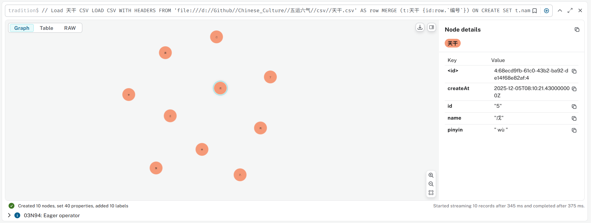
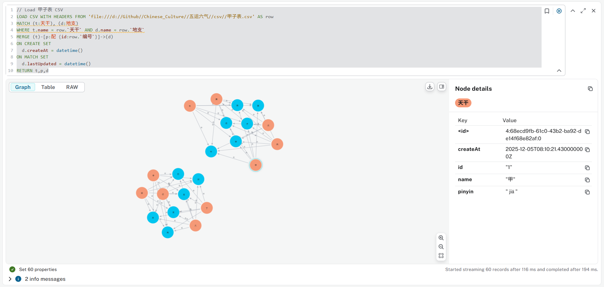
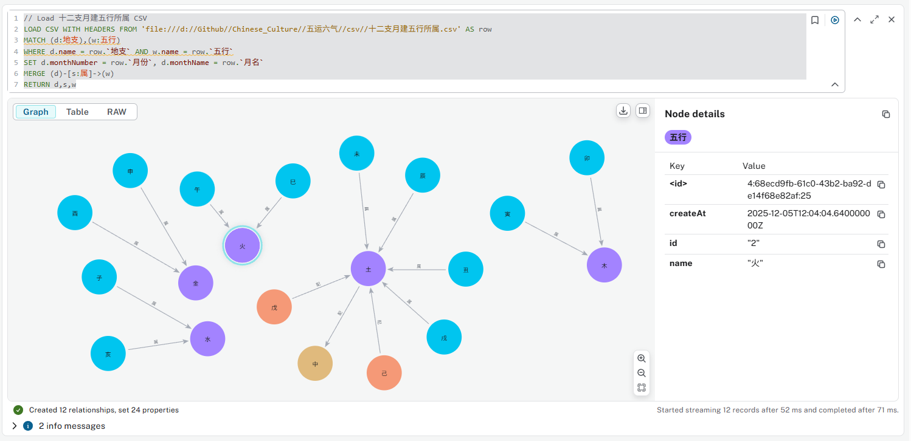
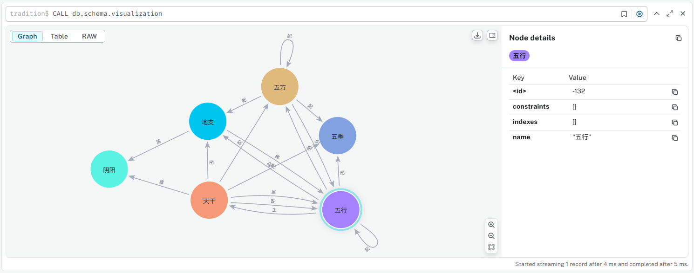

# Create Graph for Chinese Tradition Culture

- [Create Graph for Chinese Tradition Culture](#create-graph-for-chinese-tradition-culture)
  - [Create `阴阳` node](#create-阴阳-node)
  - [Add `天干` node](#add-天干-node)
  - [Add `地支` node](#add-地支-node)
  - [Refactor 天干地支 to Match 阴阳](#refactor-天干地支-to-match-阴阳)
  - [创建`甲子表`，建立天干与地支的关系`配`](#创建甲子表建立天干与地支的关系配)
  - [Query 天干地支](#query-天干地支)
  - [添加 五行、五方、五季](#添加-五行五方五季)
  - [创建 十干五行配合 关系](#创建-十干五行配合-关系)
  - [创建 十二支月建五行所属 关系](#创建-十二支月建五行所属-关系)
  - [十干化运：对于天干到五行之配属关系，添加五行到天干之“主”关系](#十干化运对于天干到五行之配属关系添加五行到天干之主关系)
  - [目前为止的schema](#目前为止的schema)

## Create `阴阳` node

```cypher
MERGE (y1:阴阳 {id:1, name:"阳"})
MERGE (y2:阴阳 {id:2, name:"阴"})
```

## Add `天干` node

```cypher
// Load 天干 CSV
LOAD CSV WITH HEADERS FROM 'file:///d://Github//Chinese_Culture//五运六气//csv//天干.csv' AS row
MERGE (t:天干 {id:row.`编号`})
ON CREATE SET
  t.name = row.`天干`,
  t.pinyin = row.`拼音`,
  t.yinyang = row.`阴阳`,
  t.createAt = datetime()
ON MATCH SET
  t.name = row.`天干`,
  t.pinyin = row.`拼音`,
  t.yinyang = row.`阴阳`,
  t.lastUpdated = datetime()
RETURN t
```



## Add `地支` node

```cypher
// Load 地支 CSV
LOAD CSV WITH HEADERS FROM 'file:///d://Github//Chinese_Culture//五运六气//csv//地支.csv' AS row
MERGE (d:地支 {id:row.`编号`})
ON CREATE SET
  d.name = row.`地支`,
  d.pinyin = row.`拼音`,
  d.yinyang = row.`阴阳`,
  d.createAt = datetime()
ON MATCH SET
  d.name = row.`地支`,
  d.pinyin = row.`拼音`,
  d.yinyang = row.`阴阳`,
  d.lastUpdated = datetime()
RETURN d
```


## Refactor 天干地支 to Match 阴阳

```cypher
// 阳干属阳
MATCH (t:天干),(y:阴阳)
WHERE t.yinyang CONTAINS "阳" AND y.name = "阳"
MERGE (t)-[s:属]->(y)
RETURN t,s,y
```

```cypher
// 阴干属阴
MATCH (t:天干),(y:阴阳)
WHERE t.yinyang = "阴干" AND y.name = "阴"
MERGE (t)-[s:属]->(y)
RETURN t,s,y
```

```cypher
// 阳支属阳
MATCH (d:地支),(y:阴阳)
WHERE d.yinyang CONTAINS "阳" AND y.name = "阳"
MERGE (d)-[s:属]->(y)
RETURN d,s,y
```

```cypher
// 阴支属阴
MATCH (d:地支),(y:阴阳)
WHERE d.yinyang CONTAINS "阴" AND y.name = "阴"
MERGE (d)-[s:属]->(y)
RETURN d,s,y
```

## 创建`甲子表`，建立天干与地支的关系`配`

```cypher
// Load 甲子表 CSV
LOAD CSV WITH HEADERS FROM 'file:///d://Github//Chinese_Culture//五运六气//csv//甲子表.csv' AS row
MATCH (t:天干), (d:地支)
WHERE t.name = row.`天干` AND d.name = row.`地支`
MERGE (t)-[p:配 {id:row.`编号`}]->(d)
ON CREATE SET
  d.createAt = datetime()
ON MATCH SET
  d.lastUpdated = datetime()
RETURN t,p,d
```



## Query 天干地支

```cypher
MATCH (t:天干)-[p:配]->(d:地支)
RETURN t,p,d
```

## 添加 五行、五方、五季

```cypher
// Load 五行 CSV
LOAD CSV WITH HEADERS FROM 'file:///d://Github//Chinese_Culture//五运六气//csv//五行.csv' AS row
MERGE (w:五行 {id:row.`编号`})
ON CREATE SET
  w.name = row.`五行`,
  w.createAt = datetime()
ON MATCH SET
  w.name = row.`五行`,
  w.lastUpdated = datetime()
RETURN w
```

```cypher
// Load 五方 CSV
LOAD CSV WITH HEADERS FROM 'file:///d://Github//Chinese_Culture//五运六气//csv//五方.csv' AS row
MERGE (w:五方 {id:row.`编号`})
ON CREATE SET
  w.name = row.`五方`,
  w.createAt = datetime()
ON MATCH SET
  w.name = row.`五方`,
  w.lastUpdated = datetime()
RETURN w
```

```cypher
// Load 五季 CSV
LOAD CSV WITH HEADERS FROM 'file:///d://Github//Chinese_Culture//五运六气//csv//五季.csv' AS row
MERGE (w:五季 {id:row.`编号`})
ON CREATE SET
  w.name = row.`五季`,
  w.createAt = datetime()
ON MATCH SET
  w.name = row.`五季`,
  w.lastUpdated = datetime()
RETURN w
```

## 创建 十干五行配合 关系

```cypher
// Load 十干五行配合表 CSV
LOAD CSV WITH HEADERS FROM 'file:///d://Github//Chinese_Culture//五运六气//csv//十干五行配合表.csv' AS row
MATCH (t:天干), (w1:五行), (w2:五方), (w3:五季)
WHERE t.name = row.`天干` AND w1.name = row.`五行` AND w2.name = row.`五方` AND w3.name = row.`五季`
MERGE (t)-[p1:配]->(w1)
MERGE (w1)-[p2:配]->(w2)
MERGE (w2)-[p3:配]->(w3)
RETURN t,p1,p2,p3,w1,w2,w3
```


## 创建 十二支月建五行所属 关系

```cypher
// Load 十二支月建五行所属 CSV
LOAD CSV WITH HEADERS FROM 'file:///d://Github//Chinese_Culture//五运六气//csv//十二支月建五行所属.csv' AS row
MATCH (d:地支),(w:五行)
WHERE d.name = row.`地支` AND w.name = row.`五行`
SET d.monthNumber = row.`月份`, d.monthName = row.`月名`
MERGE (d)-[s:属]->(w)
RETURN d,s,w
```



## 十干化运：对于天干到五行之配属关系，添加五行到天干之“主”关系

```cypher
MATCH (t:天干)-[r:配]->(w:五行)
MERGE (w)-[z:主]->(t)
RETURN t,r,w,z
```


## 目前为止的schema



---

Last updated at 12/5/2025, 8:26:37 PM 